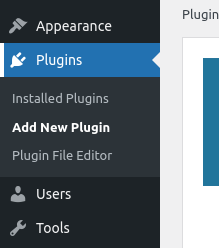
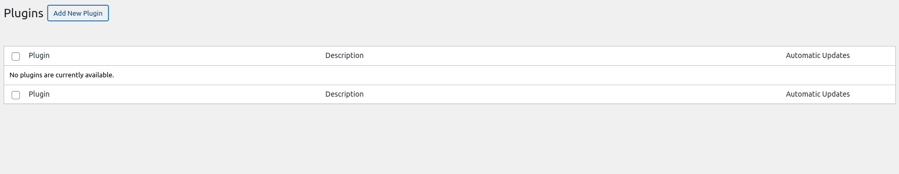
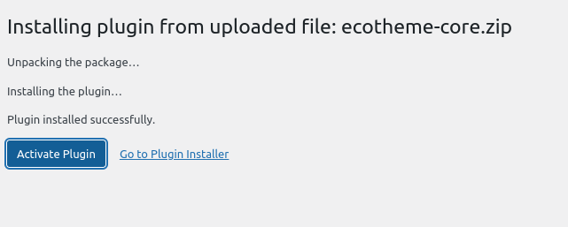
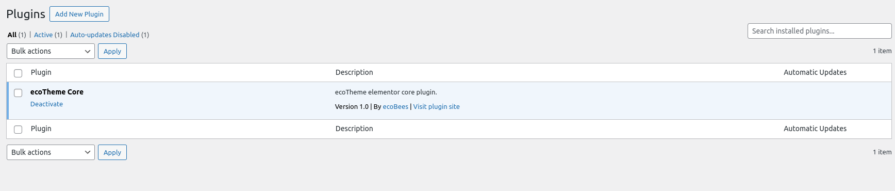

# Installing Ecotheme-core Plugin

After successfully activating Ecotheme, the next step is to install the `ecotheme-core` plugin. This plugin is essential for the full functionality of Ecotheme, providing additional features and customization options. Follow these steps to install the `ecotheme-core` plugin

## Step 1: Navigate to Plugins

1. Log in to your WordPress Dashboard.
2. Go to `Plugins > Add New`.
   

## Step 2: Upload the Ecotheme-core Plugin

1. Click on `Add New` and then click on `Upload Plugin`.
   
2. Click `Add New` again, then click `Upload Plugin > Choose File`.

## Step 3: Select the Plugin Zip File

1. Navigate to the `.zip` file for the `ecotheme-core` plugin on your computer.
   
2. Select the file and click `Install Now`.

## Step 4: Activate the Plugin

1. Once the installation is complete, click `Activate`.
   

## Step 5: Verify Plugin Activation

1. Go to `Plugins` to see the list of installed plugins.
2. Confirm that the `ecotheme-core` plugin is listed and activated.
   

## Step 6: Plugins Activated

Congratulations! You have successfully installed and activated the `ecotheme-core` plugin. Your Ecotheme installation is now complete, and you can start customizing your site with the additional features provided by the `ecotheme-core` plugin.

## Next Steps

- **Customize Your Site**: Use the `ecotheme-core` plugin to customize your site's appearance and functionality.
- **Explore Additional Plugins**: Consider installing other Ecotheme plugins to enhance your site further.
- **Update Regularly**: Keep your Ecotheme and `ecotheme-core` plugin updated to benefit from the latest features and security fixes.

## Support and Documentation

If you encounter any issues or need further assistance, refer to the Ecotheme documentation or contact Ecotheme support.
