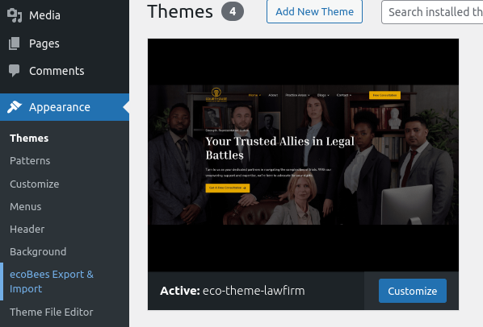
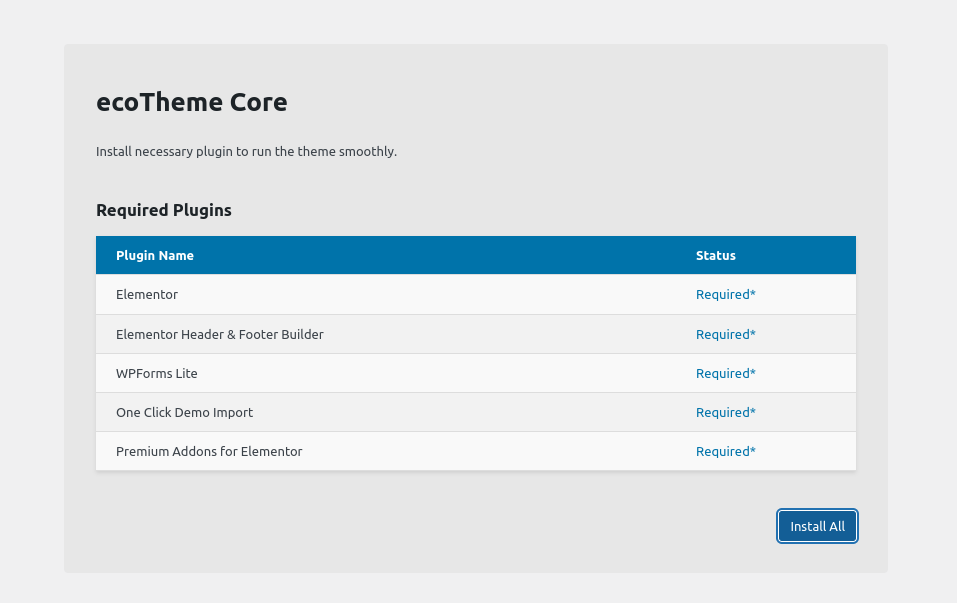
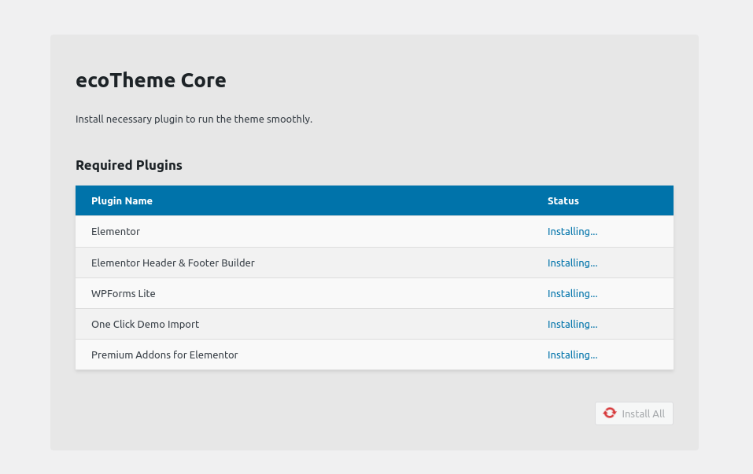
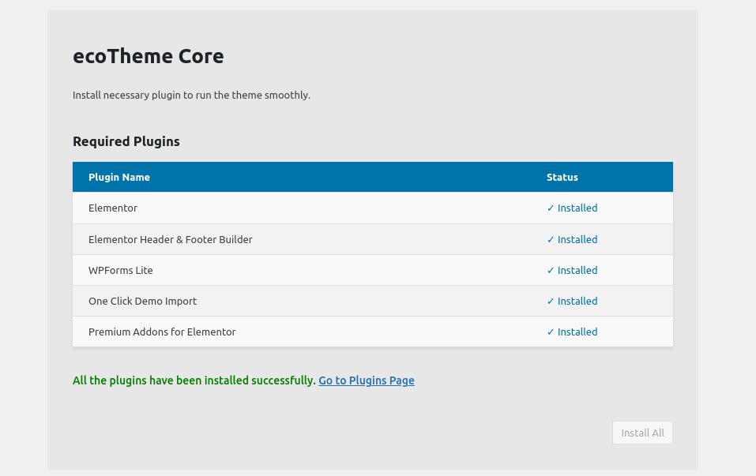

# Installing Required Plugins for Ecotheme

After activating Ecotheme and installing the `ecotheme-core` plugin, the next step is to install the required plugins for Ecotheme. These plugins enhance the functionality and features of Ecotheme, ensuring your site is fully optimized and customizable. Follow these steps to install the required plugins

## Step 1: Navigate to Ecobees Export & Import

1. Log in to your WordPress Dashboard.
2. Go to `Appearance > Ecobees Export & Import`.

   

## Step 2: Install All Required Plugins

1. Click on the `Install All` button to start the installation process for all required plugins.

   

2. You will see an "Installing" message after clicking the button, indicating that the installation process has begun.

   

## Step 3: Verify Installation Completion

Once the installation is completed, you will receive a message indicating that all the plugins have been successfully installed.

## Step 4: Verify Plugin Installation

1. Go to `Plugins` to see the list of installed plugins.
2. Confirm that all the required plugins for Ecotheme are listed and activated.

## Step 5: Plugins Installed

Congratulations! You have successfully installed all the required plugins for Ecotheme. Your site is now fully equipped with the necessary plugins to take full advantage of Ecotheme's features and customization options.

## Next Steps

- **Customize Your Site**: Use the installed plugins to customize your site's appearance and functionality according to your needs.
- **Explore Additional Features**: Discover the additional features and customization options provided by the installed plugins.
- **Regular Updates**: Keep your plugins updated to ensure you have the latest features and security fixes.

## Support and Documentation

If you encounter any issues or need further assistance, refer to the Ecotheme documentation or contact Ecotheme support.
