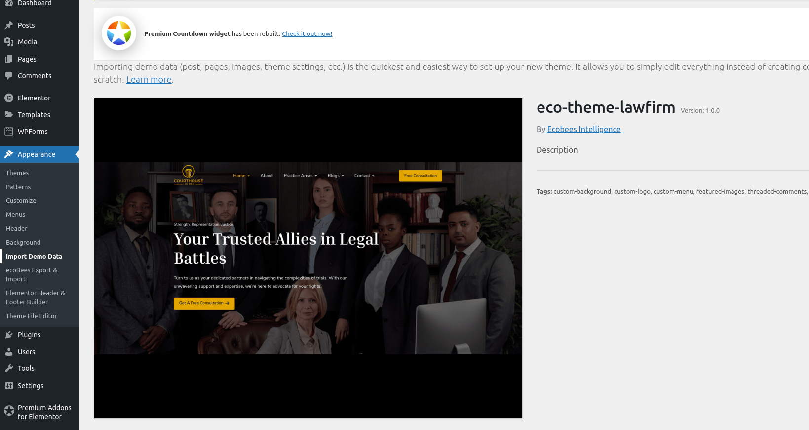
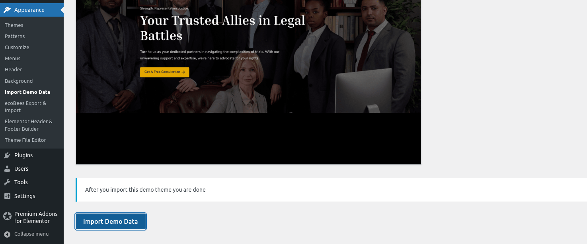
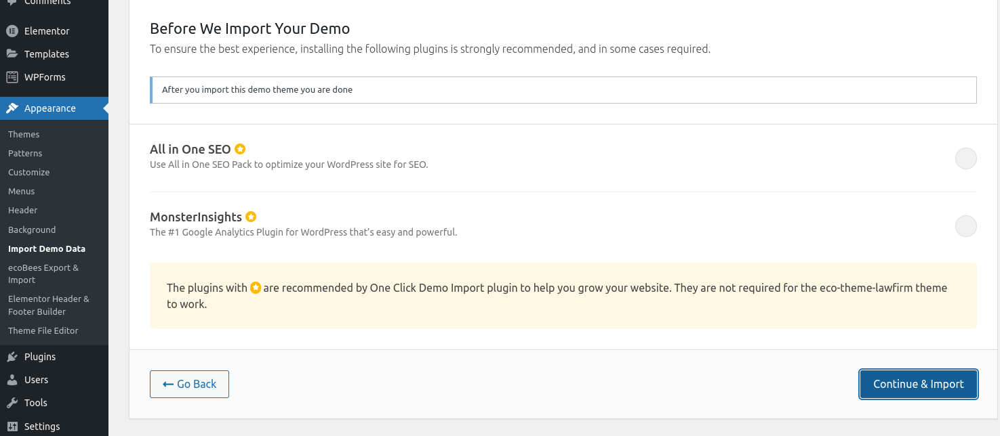
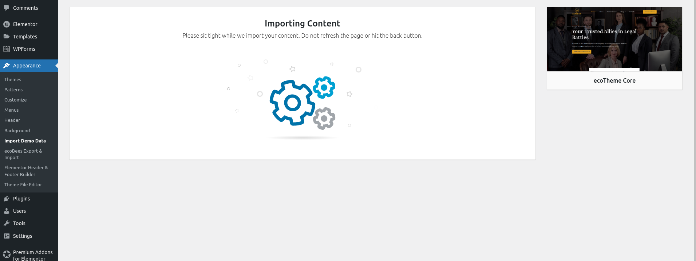
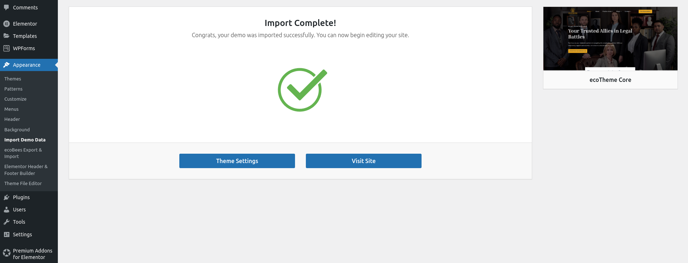
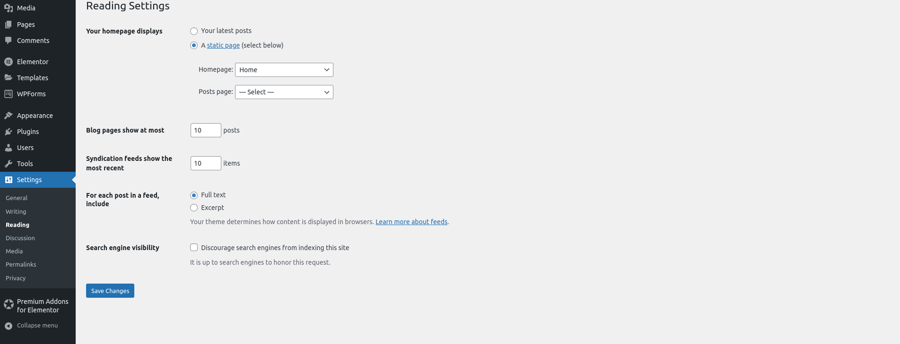
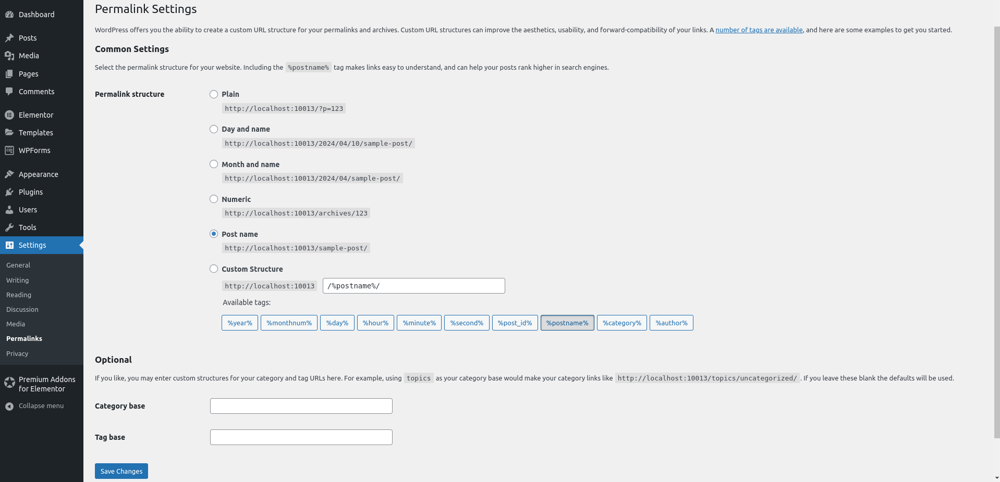

# Importing Demo Data for Ecotheme

Ecotheme offers a convenient way to import demo data, allowing you to quickly set up your site with a complete data package. This feature is particularly useful for getting started with Ecotheme or for setting up a new site. Follow these steps to import demo data:

## Step 1: Navigate to Import Demo Data

1. Log in to your WordPress Dashboard.
2. Go to `Appearance > Import Demo Data`.

## Step 2: Start the Import Process

1. Click on `Import this demo`.

2. Click `Continue & Import`.

## Step 3: Wait for the Process to Complete

1. Relax and enjoy a cup of coffee while the import process completes. The process usually takes a few minutes.

## Step 4: Finalizing importing demo data

After the import process is complete, you'll get a Import Complete message.

### Step 4.1: Set the Front Page

1. Go to `Settings > Reading`.
2. Under `Front page displays`, choose the page you'd like to set as your front page.
3. Click `Save changes`.

### Step 4.2: Fix Any Link Issues

If you encounter any link issues after the import, follow these steps to resolve them

1. Go to `Settings > Permalinks`.
2. Click `Save changes`.

## Step 5: Enjoy Your New Site

Congratulations! You've successfully imported demo data for Ecotheme, and your site is now set up and ready to go. You can now start customizing your site and exploring all the features Ecotheme has to offer. Visit your new homepage and see your theme.

## Next Steps

- **Customize Your Site**: Use the Ecotheme customizer to personalize your site's appearance and functionality.
- **Explore Additional Features**: Discover the additional features and customization options provided by Ecotheme.
- **Regular Updates**: Keep your Ecotheme theme and plugins updated to ensure you have the latest features and security fixes.

## Support and Documentation

If you encounter any issues or need further assistance, refer to the Ecotheme documentation or contact Ecotheme support.
