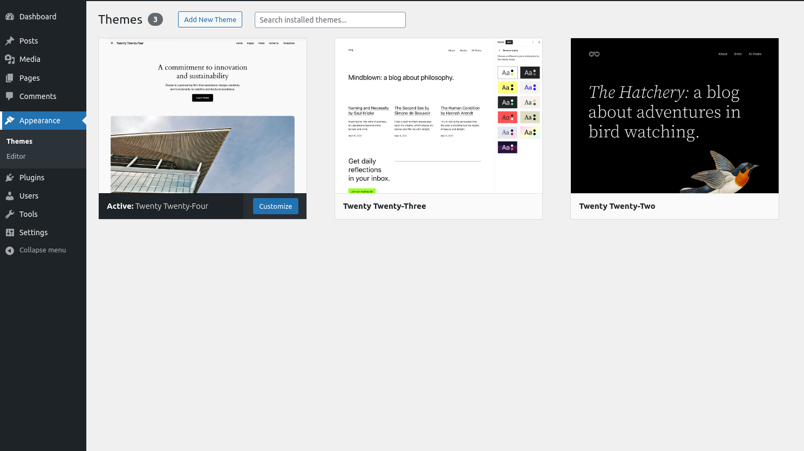
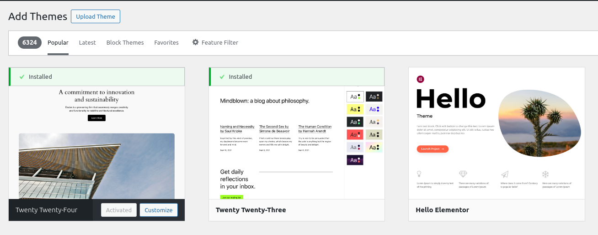
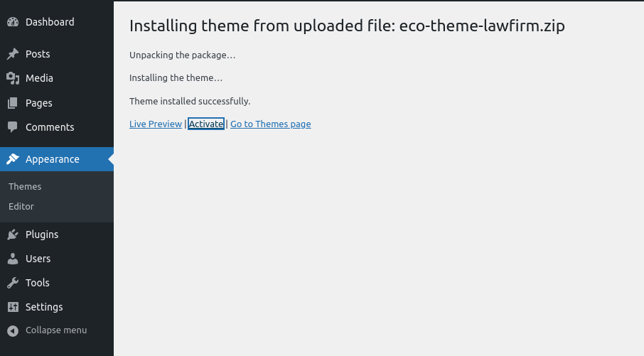
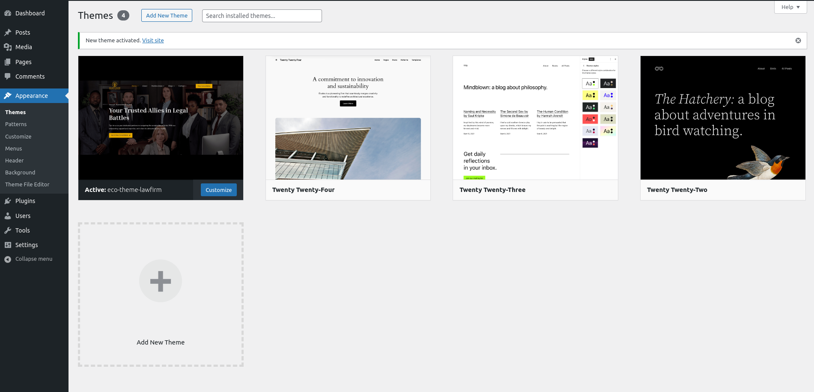

# Installing Eco Themes on WordPress

Follow these simple steps to install Eco Themes on your WordPress site. This process won't take much of your time.

## Step 1: Download the Theme Zip File

First, you need to download the Eco Themes zip file from the official source. Ensure you have the latest version to take advantage of all the features and updates.

## Step 2: Extract the Zip File

After downloading, extract the zip file on your computer. Locate the installable WordPress file within the extracted folder. This file is usually named something like `eco-themes.zip`.

## Step 3: Log in to Your WordPress Dashboard

Open your web browser and navigate to your WordPress Dashboard. The URL typically looks like `http://yourwebsite.com/wp-admin`. Log in using your admin credentials.

## Step 4: Navigate to Appearance > Themes

Once logged in, look for the "Appearance" menu on the left side of your dashboard. Click on it, and then select "Themes" from the dropdown menu.

## Step 5: Add New Theme

On the Themes page, click on the "Add New" button located at the top of the page. This will open a new page where you can add a new theme.

## Step 6: Upload Theme

On the "Add New" page, click on the "Upload Theme" button. This will open a new section where you can upload your theme zip file.

## Step 7: Choose File

Click on the "Choose File" button and navigate to the location on your computer where you extracted the Eco Themes zip file. Select the zip file and click "Install Now".

## Step 8: Install and Activate

After selecting the zip file, WordPress will start the installation process. Once the installation is complete, you will see an "Activate" button. Click on it to activate the Eco Themes on your WordPress site.

## Step 9: Done

Congratulations! You have successfully installed and activated Eco Themes on your WordPress site. You will be redirected to the Themes page where you can see Eco Themes activated.

## Additional Tips

- **Backup Your Site**: Before installing a new theme, it's always a good idea to backup your WordPress site. This ensures that you can restore your site to its previous state if anything goes wrong during the installation process.
- **Check Theme Compatibility**: Ensure that the Eco Themes is compatible with your version of WordPress. Incompatibility can lead to issues with your site's functionality.
- **Customize Your Theme**: After activating Eco Themes, you can customize it to match your branding and preferences. Navigate to "Appearance" > "Customize" to start customizing your theme.
